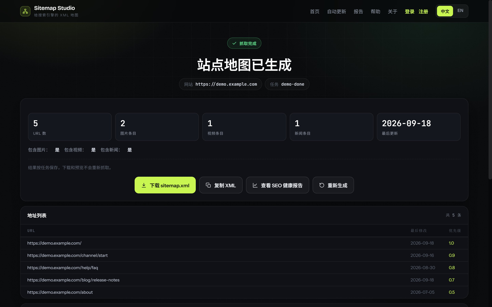
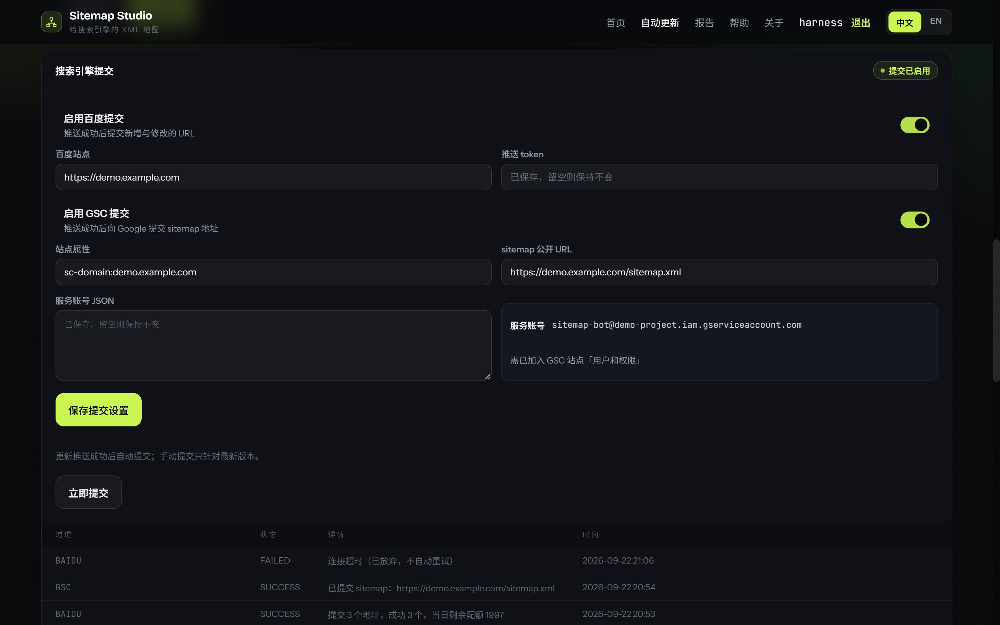

# Sitemap Studio

[](https://github.com/gh-gongjin/sitemap-studio/actions/workflows/ci.yml)
[](LICENSE)
[](https://github.com/gh-gongjin/sitemap-studio/releases)

**English** | [中文](#中文说明)

A free, self-hosted sitemap generator with a bilingual (中文 / English) web UI.
Crawl any public website, generate a standards-compliant XML sitemap, and manage
the full SEO workflow — reports, exports, scheduled updates, and push to search
engines — from a single Spring Boot application.

<p align="center">
  
</p>

<table>
  <tr>
    <td width="50%"></td>
    <td width="50%"></td>
  </tr>
  <tr>
    <td align="center"><b>Sitemap result · 生成结果与下载</b></td>
    <td align="center"><b>Live crawl board · 实时抓取看板</b></td>
  </tr>
  <tr>
    <td></td>
    <td></td>
  </tr>
  <tr>
    <td align="center"><b>SEO report · 报告与 CSV/PDF/Word 导出</b></td>
    <td align="center"><b>Report history · 历史报告</b></td>
  </tr>
  <tr>
    <td></td>
    <td></td>
  </tr>
  <tr>
    <td align="center"><b>Auto-update · 定时更新站点</b></td>
    <td align="center"><b>Push · SFTP/FTP/FTPS + IndexNow</b></td>
  </tr>
  <tr>
    <td></td>
    <td></td>
  </tr>
  <tr>
    <td align="center"><b>Submission · 百度主动推送 + Search Console</b></td>
    <td align="center"><b>Submit now · 立即提交确认与提交记录</b></td>
  </tr>
</table>

## Features

- **Sitemap generation** — depth-first crawler (Jsoup, optional headless browser for JS-rendered sites) producing valid XML sitemaps. Guest access: crawl, preview, and download need no account.
- **Image / Video / News sitemaps** — optional inclusion of image, video, and Google News extensions per task.
- **SEO reports** — per-crawl audit report with CSV / PDF / Word export. Reports are scoped to the signed-in user.
- **Auto-update & push** — register a site, schedule re-crawls, and publish results via SFTP / FTP / FTPS, with IndexNow notification for Bing / Yandex.
- **Search engine submission** — after each successful push, or on demand, submit new and changed URLs to Baidu and the sitemap location to Google Search Console; the latest attempts are logged per site.
- **Account isolation** — Spring Security form login; users only ever see (and receive 404, not 403, for) their own reports and sites.
- **Bilingual UI** — full Chinese / English i18n, dark-first responsive design.
- **Zero external services** — embedded H2 file database, runs as a single jar or one Docker container.

## Tech Stack

Java 21 · Spring Boot 3.5 · Thymeleaf · Spring Security · Jsoup · MyBatis-Plus · H2 · Maven

## Quick Start

### Docker (recommended)

The image is published to GHCR on every release — no clone, no build, no login:

```sh
docker run -d --name sitemap-studio -p 8080:8080 \
  -v sitemap-studio-data:/app/data \
  ghcr.io/gh-gongjin/sitemap-studio:1.2.0
```

`:latest` tracks the newest release. To build the image yourself instead:

```sh
git clone https://github.com/gh-gongjin/sitemap-studio.git
cd sitemap-studio
docker compose up -d --build      # or: docker build -t sitemap-studio .
```

Open **http://localhost:8080**. Reports, scheduled sites and the encrypted push
key live in the `sitemap-studio-data` volume, so they survive rebuilds and
`docker rm`. Stop with `docker stop sitemap-studio` (plus `docker rm`), or
`docker compose down` for the Compose path (add `-v` to wipe the data too).
Optional: set `SITEMAP_PUSH_KEY` (Base64-encoded 32 bytes) in the environment to
fix the push-credential encryption key instead of auto-generating one.

> The image runs the crawler, reports and push features. Opt-in JS rendering
> (`sitemap.generator.renderer.enabled=true`) needs Playwright browsers that are
> not bundled in the image; use the jar below on a machine that already has them.

### From source

Requirements: JDK 21+ and Maven 3.9+ (`java -version`, `mvn --version`).

```sh
mvn verify
java -jar target/sitemap-studio-1.2.0.jar
```

Open **http://localhost:8080**. On Windows you can run `start.bat`, which checks
toolchain versions, runs `mvn verify`, and launches the jar in the foreground
(`Ctrl+C` to stop). Pass Spring Boot arguments after the script, e.g.
`start.bat --server.port=8081`.

Data is stored in `./data/` (H2 file database) — delete the directory to start fresh.

## Development

```sh
mvn test    # unit & MockMvc tests
mvn verify  # full build with tests and packaging
```

Once dependencies are cached, offline builds work with `mvn -o verify`. The
project-local `.mvn/` settings only affect this build and never touch your
global Maven configuration.

## Usage Limits & Caveats

- Only publicly accessible HTTP(S) sites can be crawled; internal, loopback, and `file://` targets are refused, and `robots.txt` is honored. Respect target-site rules and only crawl content you are authorized to access.
- A single task crawls at most **1000 URLs** to a depth of 10; completeness is not guaranteed and results depend on network, site access restrictions, and link structure.
- Crawl results (preview / sitemap.xml download) live in memory for **30 minutes**; SEO reports are persisted to the local H2 database on completion and can be revisited or exported (CSV / PDF / Word) at any time, as can auto-update site versions.

## License

Apache License 2.0 — see [LICENSE](LICENSE).

Contributions are welcome: see [CONTRIBUTING.md](CONTRIBUTING.md) for the
branch/PR workflow and project conventions, and [SECURITY.md](SECURITY.md) for
private vulnerability reporting.

---

<a name="中文说明"></a>

# 中文说明

Sitemap Studio 是一款免费、可自托管的站点地图生成器，提供中英双语 Web 界面。
抓取任意公开网站、生成符合规范的 XML 站点地图，并在单个 Spring Boot 应用中完成
完整 SEO 工作流——报告、导出、定时更新与搜索引擎推送。

> 界面截图见文首图集（页面截图为中文界面，首张为英文首页）。

## 功能特性

- **站点地图生成**：基于 Jsoup（可选无头浏览器渲染 JS 页面）的深度优先爬虫，输出合法 XML 站点地图。游客免登录即可爬取、预览、下载。
- **图片 / 视频 / 新闻站点地图**：每个任务可选启用 image、video 与 Google News 扩展。
- **SEO 报告**：每次爬取生成审计报告，支持 CSV / PDF / Word 导出；报告按登录账号隔离。
- **自动更新与推送**：登记站点后可定时重新爬取，通过 SFTP / FTP / FTPS 发布结果，并支持 IndexNow 通知 Bing / Yandex 等搜索引擎。
- **搜索引擎提交**：每次推送成功后（或在详情页点「立即提交」）向百度主动推送接口提交新增与修改的 URL，并向 Google Search Console 提交 sitemap 地址；每站保留最近的提交记录。
- **账号隔离**：Spring Security 表单登录；用户只能看到本人报告与站点（越权访问返回 404 而非 403）。
- **双语界面**：完整的中文 / 英文国际化，深色优先响应式设计。
- **零外部依赖**：内嵌 H2 文件数据库，单一 jar 或一个 Docker 容器即可运行。

## 技术栈

Java 21 · Spring Boot 3.5 · Thymeleaf · Spring Security · Jsoup · MyBatis-Plus · H2 · Maven

## 快速开始

### Docker 部署（推荐）

每次发版都会把镜像推到 GHCR，无需克隆、构建或登录：

```sh
docker run -d --name sitemap-studio -p 8080:8080 \
  -v sitemap-studio-data:/app/data \
  ghcr.io/gh-gongjin/sitemap-studio:1.2.0
```

`:latest` 始终指向最新正式版。想自己构建镜像则用：

```sh
git clone https://github.com/gh-gongjin/sitemap-studio.git
cd sitemap-studio
docker compose up -d --build      # 或 docker build -t sitemap-studio .
```

启动后访问 **http://localhost:8080**。报告、定时更新站点与推送加密密钥都存在
`sitemap-studio-data` 数据卷里，重建或删除容器都不会丢数据。停止用
`docker stop sitemap-studio`（再 `docker rm`），Compose 路径用 `docker compose down`
（加 `-v` 会连数据一起清除）。可选：通过环境变量
`SITEMAP_PUSH_KEY`（Base64 编码的 32 字节）固定推送凭据加密密钥，否则首次启动自动生成。

> 镜像内包含爬虫、报告与推送等全部能力；可选的 JS 页面渲染
> （`sitemap.generator.renderer.enabled=true`）依赖镜像未打包的 Playwright 浏览器，
> 需要该能力时请使用下面 jar 方式在已装浏览器的机器上运行。

### 源码运行

环境要求：JDK 21+ 与 Maven 3.9+（可用 `java -version`、`mvn --version` 核对）。

```sh
mvn verify
java -jar target/sitemap-studio-1.2.0.jar
```

启动后访问 **http://localhost:8080**。Windows 下可直接运行 `start.bat`：脚本会
核对工具链版本、执行 `mvn verify` 并前台启动 jar（`Ctrl+C` 停止）。脚本后接的
参数会透传给应用，例如 `start.bat --server.port=8081`。

数据保存在 `./data/`（H2 文件数据库），删除该目录即可重置。

## 开发与测试

```sh
mvn test    # 单元与 MockMvc 测试
mvn verify  # 含测试与打包的完整构建
```

依赖缓存齐备后可离线构建：`mvn -o verify`。项目内的 `.mvn/` 配置只作用于本
项目构建，不会修改全局 Maven 配置。

## 使用范围与限制

- 仅支持抓取公开可访问的 HTTP(S) 站点，内网、回环地址与本机文件会被拒绝，并遵循目标站点的 `robots.txt`；请遵守目标站点规则，仅抓取有权访问的内容。
- 单次任务最多抓取 **1000 个 URL**、深度不超过 10 层；结果受网络、站点访问限制与链接结构影响，不保证收录全部页面。
- 爬取结果（预览 / sitemap.xml 下载）在内存中保留 **30 分钟**；SEO 报告在任务完成后持久化到本地 H2 数据库，可随时回看与导出（CSV / PDF / Word），自动更新站点版本同样持久化。

## 许可证

Apache License 2.0，详见 [LICENSE](LICENSE)。

欢迎贡献代码：分支/PR 流程与项目约定见 [CONTRIBUTING.md](CONTRIBUTING.md)，
安全漏洞请通过 [SECURITY.md](SECURITY.md) 描述的私有渠道报告。
